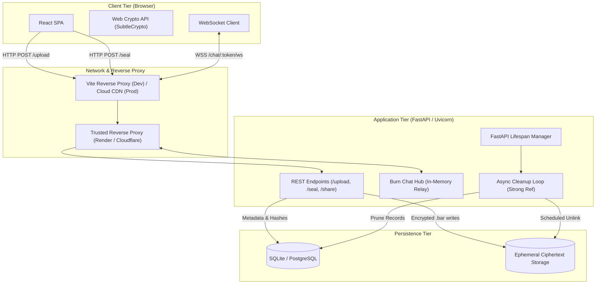
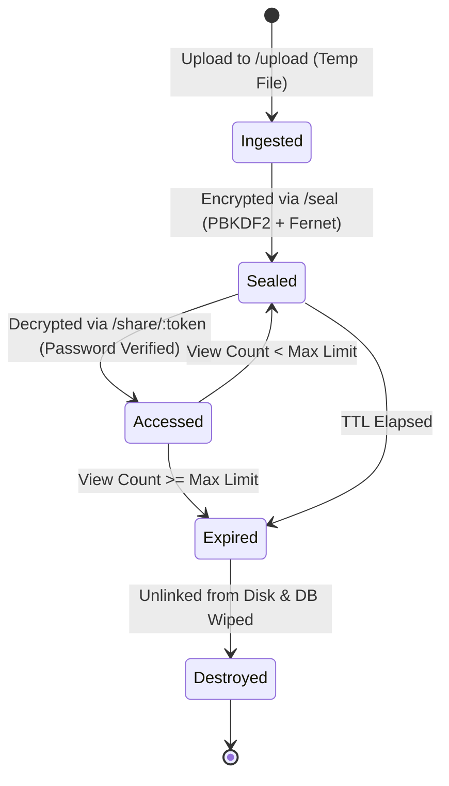
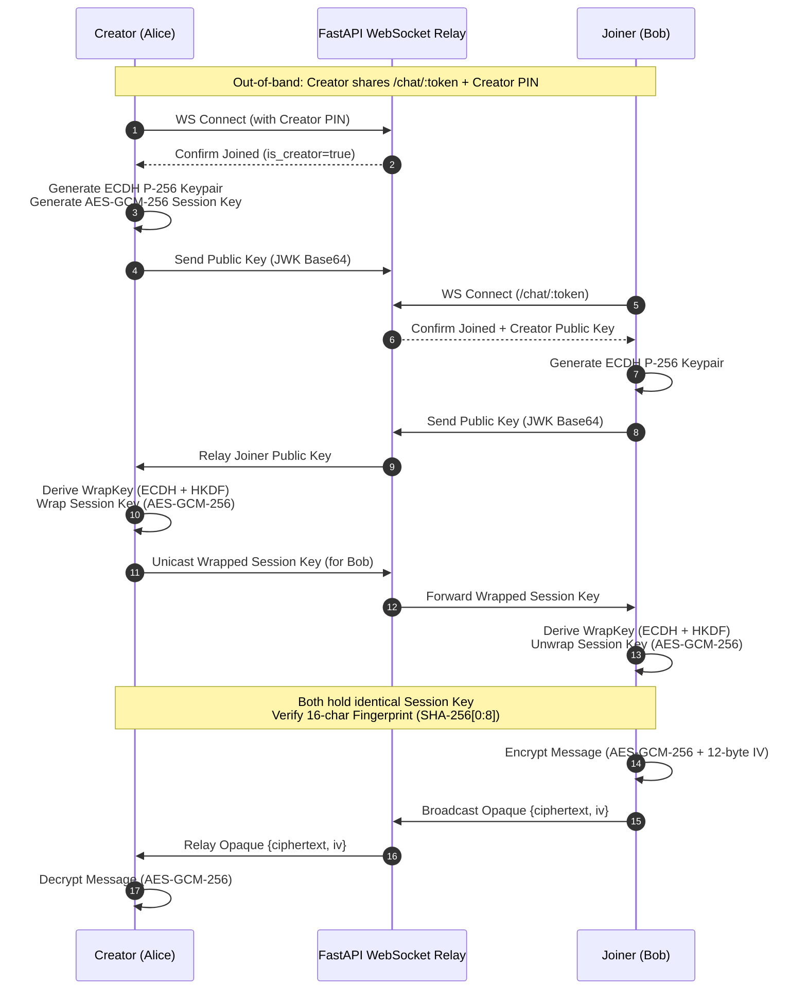
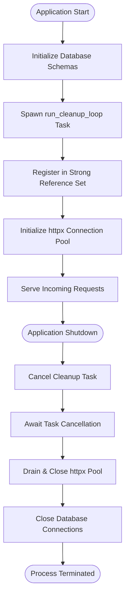

# BAR Architecture & Trust Boundaries

[Back to README](../README.md) | [Cryptography](CRYPTOGRAPHY.md) | [API Specification](API_SPECIFICATION.md) | [Development](DEVELOPMENT.md) | [Operations](OPERATIONS.md)

Technical architecture, security models, state machines, and trust boundary specifications for the BAR (Burn After Reading) platform.

---

## 1. System Overview & Dual Security Model

BAR provides ephemeral data exchange across two independent, non-overlapping subsystems:

1. **Sealed File Containers (SEAD):** Server-Side Encrypted at Rest with Ephemeral Auto-Destruction.
2. **Burn Chat (E2EE):** Client-Side Zero-Knowledge End-to-End Encrypted Messaging.



---

## 2. Ephemeral File Sharing (SEAD)

### 2.1 Threat Model & Trust Boundary
* **Target Adversaries:** Unauthorized third parties with physical disk access, database exfiltration attackers, and unauthenticated network eavesdroppers.
* **Trust Boundary:** The server is trusted to perform symmetric encryption at the ingest boundary and immediately wipe plaintext from memory. The server is untrusted by the recipient until the decryption key or password is provided.
* **Data-at-Rest Guarantee:** Plaintext never touches non-volatile storage. The on-disk artifact is always an authenticated Fernet container.

### 2.2 Lifecycle & State Transitions
File containers transition through a strict, irreversible state lifecycle:



### 2.3 Storage Invalidation & Deletion Mechanics
BAR avoids traditional multi-pass overwrites (e.g., DoD 5220.22-M or Gutmann), which are ineffective on modern wear-leveling solid-state drives (SSDs) and virtualized cloud block stores. Instead, secure deletion relies on:

1. **Cryptographic Erasure:** The unique password-derived key material exists only in transient memory during active operations. When the database record and salt are purged, the remaining ciphertext becomes mathematically impossible to decrypt.
2. **Filesystem Unlinking:** The `.bar` ciphertext file is immediately unlinked via `os.remove()`.
3. **Underlying Infrastructure FDE:** Cloud deployments must enable Full-Disk Encryption (e.g., AWS EBS encryption, Render encrypted volumes, GCP CMEK) to ensure hardware-level sanitization upon block reallocation.

---

## 3. Burn Chat (E2EE)

### 3.1 Threat Model & Zero-Knowledge Boundary
* **Target Adversaries:** Compromised relay infrastructure, malicious network intermediaries, rogue server administrators, and memory-dump inspection.
* **Trust Boundary:** The server is entirely untrusted. The backend operates exclusively as a blind, in-memory message and key-exchange broker.
* **Zero Persistence:** Neither messages, plaintext, ciphertexts, room metadata, nor keys are written to persistent storage. All room state resides in RAM and is destroyed upon session termination.

### 3.2 Key Agreement & Relay Protocol
Key distribution uses a creator-centric star topology:



### 3.3 Concurrency & Slowloris Mitigation
WebSocket broadcasts are vulnerable to denial-of-service when individual clients stall on TCP receive buffers. The Burn Chat broadcast loop implements isolated concurrency boundaries:

* Every client transmission is dispatched as an independent asynchronous task:
  ```python
  task_map = {asyncio.create_task(ws.send_json(payload)): ws_id for ws_id, p in targets}
  done, pending = await asyncio.wait(task_map.keys(), timeout=3.0)
  ```
* Any task failing to complete within `3.0` seconds is cancelled immediately.
* The offending socket is terminated with WebSocket close code `1001`, and the participant is purged from room memory.

---

## 4. Application Lifespan & Background Tasks

The FastAPI application manages background tasks and client pools using an asynchronous lifespan context manager (`core/lifespan.py` / `app.py`):



* **Strong Task Tracking:** Background coroutines are registered in a module-level set via `track_background_task` to prevent premature Python garbage collection during loop execution.
* **Graceful Termination:** On shutdown signals (SIGINT / SIGTERM), background loops are cancelled and cleanly awaited before database connections are severed.

---

## 5. Network Security & IP Attribution

To maintain accurate rate-limiting and audit logging behind reverse proxies (e.g., Render, Cloudflare, AWS ALB), client IP extraction follows right-to-left header traversal:

1. **Peer Validation:** The direct TCP connection (`request.client.host`) is validated against `TRUSTED_PROXY_CIDRS`. If the direct peer is not in this list, `X-Forwarded-For` and `X-Real-IP` headers are discarded.
2. **Right-to-Left Traversal:** When behind a trusted proxy, `X-Forwarded-For` is parsed from right to left to locate the first untrusted IP. This prevents attackers from injecting spoofed IP addresses at the beginning of the header.
