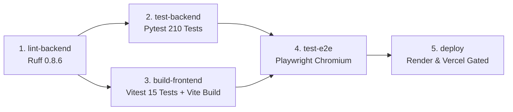

# BAR Development & Deployment Guide

[Back to README](../README.md) | [Architecture](ARCHITECTURE.md) | [Cryptography](CRYPTOGRAPHY.md) | [API Specification](API_SPECIFICATION.md) | [Operations](OPERATIONS.md)

Engineering guide for local development, reverse-proxy topologies, testing, and production deployment of the BAR (Burn After Reading) platform.

---

## 1. Prerequisites & Tooling

* **Python:** 3.10 or higher.
* **Node.js:** 18.0.0 LTS or higher.
* **Package Managers:** `pip` (Python) and `npm` (Node).
* **Virtual Environment:** Python `venv` recommended for isolated dependency management.

---

## 2. Environment Variables Configuration

Create a `.env` file inside `backend/` using `backend/.env.example` as a template:

| Variable | Type | Default | Purpose |
| :--- | :--- | :--- | :--- |
| `APP_NAME` | string | `"BAR Web"` | Application branding in logs and OpenAPI metadata. |
| `ENVIRONMENT` | string | `"development"` | Environment flag (`development`, `staging`, `production`). |
| `IS_PRODUCTION` | boolean | `false` | When `true`, restricts CORS to production domains and tightens proxy CIDRs. |
| `HOST` | string | `"0.0.0.0"` | Network interface for the Uvicorn ASGI server. |
| `PORT` | integer | `8000` | Port for the Uvicorn ASGI server. |
| `DATABASE_URL` | string | `"sqlite:///bar_files.db"` | Database connection string (SQLite or PostgreSQL). |
| `UPLOAD_DIR` | path | `"./uploads"` | Directory for staged temporary files before sealing. |
| `GENERATED_DIR` | path | `"./generated"` | Directory for sealed on-disk `.bar` containers. |
| `MAX_FILE_SIZE` | integer | `104857600` | Maximum file upload size in bytes (default: 100 MB). |
| `ALLOWED_ORIGINS` | string | `"http://localhost:5173"` | Comma-separated list of permitted CORS origins. |
| `TRUSTED_PROXY_CIDRS` | string | Render defaults | Comma-separated CIDR blocks trusted for `X-Forwarded-For` parsing. Set to `none` to disable. |
| `CHAT_PIN_MAX_FAILURES` | integer | `3` | Max failed creator PIN attempts before IP is blocked. |
| `CHAT_PIN_WINDOW_SECS` | float | `600.0` | Sliding window in seconds for creator PIN brute-force defense. |

---

## 3. Local Development Setup

### 3.1 Automated Startup (Windows)
```cmd
# Run initial dependency setup
setup.bat

# Launch backend and frontend development servers
start.bat
```

### 3.2 Manual Startup (POSIX / macOS / Linux)

#### Backend Service
```bash
cd backend
python3 -m venv .venv
source .venv/bin/activate
pip install -r requirements.txt
python run.py
```
* The backend launches at `http://localhost:8000`.
* Interactive OpenAPI documentation is accessible at `http://localhost:8000/docs`.

#### Frontend Application
```bash
cd frontend
npm install
npm run dev
```
* The frontend development server launches at `http://localhost:5173`.

---

## 4. Vite Reverse-Proxy Topology

To enable seamless single-page application (SPA) routing alongside backend API and WebSocket endpoints on a single origin, `frontend/vite.config.js` implements a custom proxy table:

```javascript
// Excerpt from frontend/vite.config.js
proxy: {
  '/upload': { target: backendUrl, changeOrigin: true },
  '/seal': { target: backendUrl, changeOrigin: true },
  '/share': {
    target: backendUrl,
    changeOrigin: true,
    bypass(req) {
      // Proxy POST/OPTIONS to backend; route GET/HEAD to React Router SPA (index.html)
      if (req.method !== 'POST' && req.method !== 'OPTIONS') {
        return '/index.html';
      }
    }
  },
  '/chat': {
    target: backendUrl,
    changeOrigin: true,
    ws: true,
    bypass(req) {
      const isWs = req.headers['upgrade'] === 'websocket';
      const isPost = req.method === 'POST';
      const isInfoRequest = /^\/chat\/[^/]+\/info(\?.*)?$/.test(req.url);
      if (!isWs && !isPost && !isInfoRequest) return '/index.html';
    }
  }
}
```

* **Method-Based Bypassing:** Paths such as `/share/:token` require different handling depending on the HTTP verb: `GET` loads the client-side decryption UI, while `POST` submits the password to the backend for stream decryption.
* **WebSocket Upgrades:** The `/chat` proxy configures `ws: true` to forward `Upgrade: websocket` headers directly to the ASGI server.

---

## 5. Backend Lifespan Architecture

The backend utilizes FastAPI's unified lifespan context manager (`@asynccontextmanager async def lifespan(app: FastAPI)`):

1. **Database Schema Verification:** `database.init_database()` creates or migrates SQLite/PostgreSQL schemas synchronously before accepting requests.
2. **Background Cleanup Loop:** `cleanup.run_cleanup_loop()` is spawned as an asynchronous task and registered with `core.concurrency.track_background_task` to prevent garbage collection.
3. **HTTP Client Management:** A shared `httpx.AsyncClient` pool is initialized for outbound webhook deliveries and geolocation analytics.
4. **Graceful Teardown:** Upon SIGTERM/SIGINT, the cleanup loop is cancelled, HTTP client connections are drained, and database connections are safely closed.

---

## 6. Testing, Quality Assurance & CI/CD

The BAR platform enforces rigorous automated testing across backend security, crypto primitives, SQLite concurrency, frontend components, Web Crypto operations, and end-to-end user flows.

### 6.1 Backend Testing Suite (Pytest)

The backend test suite is located in `backend/tests/` and comprises **13 test suites (210 automated tests)**:

| Suite | File | Focus Areas |
| :--- | :--- | :--- |
| **Crypto Security** | `test_crypto_security.py` | PBKDF2 600,000 iterations, `BarKey` domain separation (Fernet vs HMAC), header validation, canonical JSON kwargs contract. |
| **Crypto Storage** | `test_crypto_storage.py` | Fernet roundtrip, PBKDF2 deterministic derivation, packing/unpacking, metadata field tampering detection, view-count increment tampering. |
| **Analytics Security** | `test_analytics_security.py` | Right-to-left `X-Forwarded-For` traversal against trusted CIDRs, direct peer header discarding, device classification. |
| **Field Exposure** | `test_analytics_field_exposure.py` | CWE-200 prevention: static verification of allowlists (`_PUBLIC_FILE_COLUMNS`) and blocklists (`_FORBIDDEN_RESPONSE_FIELDS`). |
| **Chat Broadcast** | `test_chat_broadcast.py` | WebSocket broadcast delivery, sender exclusion, Slowloris 3.0s `asyncio.wait` timeout cancellation, close code 1001 cleanup. |
| **Chat Isolation** | `test_chat_identity_isolation.py` | Participant UUIDv4 decoupling from display names, duplicate name coexistence, creator kick moderation. |
| **Chat Service** | `test_chat_service.py` | Session lifecycle, PIN brute-force lockout, message broadcasting, room destruction. |
| **SQLite Concurrency** | `test_sqlite_concurrency.py` | 50 concurrent SQLite writes/reads under WAL mode, connection pool exhaustion, timezone handling. |
| **Atomic Views** | `test_atomic_view_count.py` | Concurrent view increments, zero over-allocation, auto-destruction trigger when `current_views == max_views`. |
| **Header Injection** | `test_header_injection.py` | CRLF injection stripping, quote escaping, RFC 5987 UTF-8 encoding, sensitive metadata stripping. |
| **Path Resolution** | `test_path_resolution.py` | Directory traversal guards (`../`, `..\\`, `%2e%2e/`, Unicode slashes, UNC paths), UUID4 validation. |
| **SSRF Guards** | `test_ssrf_guards.py` | DNS resolution checking, blocking private/loopback/link-local/IPv4-mapped addresses, alternative IP notation blocking. |
| **Storage Routes** | `test_storage_routes.py` | End-to-end integration: upload -> seal -> analytics -> share decrypt, 401 invalid password, 410 view exhaustion, 413 payload limits. |

#### Running Backend Tests
```bash
cd backend
source .venv/bin/activate  # or .venv\Scripts\activate on Windows

# Install testing dependencies
pip install -r requirements-dev.txt

# Run full test suite with coverage
pytest tests/ -v --cov=. --cov-report=term-missing
```

### 6.2 Backend Code Quality (Ruff Linter)
Static analysis is handled via `ruff` targeting Python 3.11 with configuration defined in `pyproject.toml` and `backend/pyproject.toml`:
```bash
# Run Ruff lint check
ruff check backend/

# Automatically fix fixable issues
ruff check backend/ --fix
```

### 6.3 Frontend Unit & Crypto Testing (Vitest & React Testing Library)
Frontend testing is powered by `vitest` with `jsdom` and React Testing Library, located in `frontend/src/test/`:

* **Web Crypto Agreement (`burnChatE2E.test.js`):** Validates ECDH P-256 key generation (non-extractable private keys), HKDF-SHA256 wrap key derivation, AES-GCM-256 session key wrapping/unwrapping, message integrity tampering detection, and 16-character hex fingerprinting (`SHA-256[0:8]`).
* **Component Testing (`FileUpload.test.jsx`, `DecryptPage.test.jsx`):** Validates dropzone interactions, file type validation (`.bar` enforcement), and navigation callbacks.
* **Security Utilities (`BurnChatPage.test.jsx`):** Validates WebSocket URL resolution (`resolveWsUrl`) and automatic protocol upgrading (`http:` -> `wss:` when served over HTTPS).

#### Running Frontend Tests
```bash
cd frontend

# Run Vitest in watch mode (development)
npm test

# Run Vitest single-pass (CI mode)
npm run test:run
```

### 6.4 End-to-End Testing (Playwright)
Browser-level integration tests are implemented with Playwright in `frontend/e2e/`:

* **`burn-chat.spec.js`:** Tests room creation form rendering, duration selectors, and multi-browser context interaction (creator and participant in isolated sessions).
* **`file-lifecycle.spec.js`:** Tests homepage dropzone rendering and navigation to the `.bar` file decryption interface.

#### Running Playwright E2E Tests
```bash
cd frontend

# Install Playwright browser binaries (first time)
npx playwright install chromium

# Build frontend and execute E2E tests against preview server
npm run build
npx playwright test
```

### 6.5 Continuous Integration & Deployment Pipeline (GitHub Actions)
The workflow file [`.github/workflows/ci.yml`](../.github/workflows/ci.yml) defines a 5-stage automated pipeline:



1. **`lint-backend`:** Runs Ruff static analysis on all backend files.
2. **`test-backend`:** Installs runtime and dev dependencies with pip caching, executes all 210 Pytest tests with coverage, and uploads `coverage.xml` as a build artifact.
3. **`build-frontend`:** Installs Node dependencies with npm cache, executes Vitest unit/crypto tests, and compiles the production bundle via `vite build`.
4. **`test-e2e`:** Restores Playwright browser cache, installs Chromium dependencies, builds the preview bundle, and runs Playwright end-to-end browser tests.
5. **`deploy`:** Executes exclusively on push to `master`. Evaluates `RENDER_DEPLOY_HOOK_URL` to trigger backend deployment only when all upstream verification stages succeed.

---

## 7. Production Deployment Architecture

### 7.1 Backend Containerization
* **ASGI Server:** Uvicorn running with a single worker process:
  ```bash
  uvicorn app:app --host 0.0.0.0 --port 8000 --workers 1
  ```
  > Note: Because Burn Chat maintains room state in memory, multi-worker deployments require sticky sessions or an external pub/sub layer.

### 7.2 Frontend Static CDN
* Deploy `frontend/dist/` to a global edge network (e.g., Vercel, Netlify, Cloudflare Pages).
* Configure `VITE_BACKEND_URL` in the build environment to target the production API domain.
* Configure SPA fallback rewrite rules: all non-asset requests must resolve to `index.html`.
